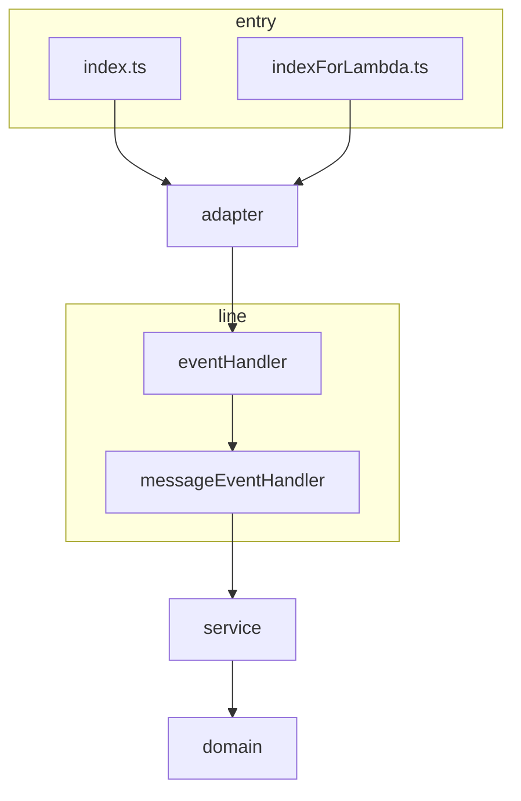

# 9999

## Install

```bash
npm ci
```

## Run

### Local

```bash
cp .env.sample .env
```

update `.env`.

https://developers.line.biz/console/

```bash
npm run dev
```

## Directory


```mermaid
graph

subgraph entry
  index.ts
  indexForLambda.ts
end

adapter

subgraph line
  eventHandler
  messageEventHandler
end

service
domain

index.ts --> adapter
indexForLambda.ts --> adapter
adapter --> eventHandler --> messageEventHandler --> service --> domain
```
